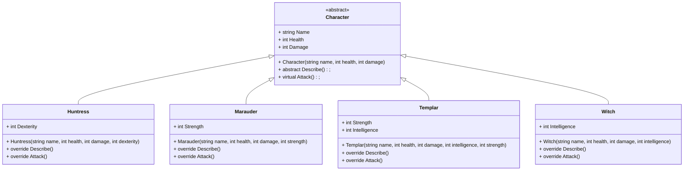

```mermaid
classDiagram

    class Character{
        <<abstract>>
        + string Name
        + int Health
        + int Damage
        + Character(string name, int health, int damage)
        + abstract Describe();
        + virtual Attack();
    }

    class Huntress {
        + int Dexterity
        + Huntress(string name, int health, int damage, int dexterity)
        + override Describe()
        + override Attack()
    }

    class Marauder {
        + int Strength
        + Marauder(string name, int health, int damage, int strength)
        + override Describe()
        + override Attack()
    }

    class Witch {
        + int Intelligence
        + Witch(string name, int health, int damage, int intelligence)
        + override Describe()
        + override Attack()
    }

    class Templar {
        + int Strength
        + int Intelligence
        + Templar(string name, int health, int damage, int intelligence, int strength)
        + override Describe()
        + override Attack()
    }

    Character <|-- Huntress
    Character <|-- Marauder
    Character <|-- Templar
    Character <|-- Witch
```