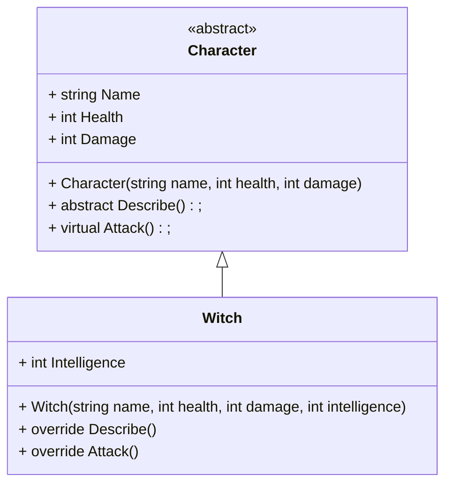

```mermaid
classDiagram

    class Character{
        <<abstract>>
        + string Name
        + int Health
        + int Damage
        + Character(string name, int health, int damage)
        + abstract Describe();
        + virtual Attack();
    }

    class Witch {
        + int Intelligence
        + Witch(string name, int health, int damage, int intelligence)
        + override Describe()
        + override Attack()
    }

    Character <|-- Witch
```