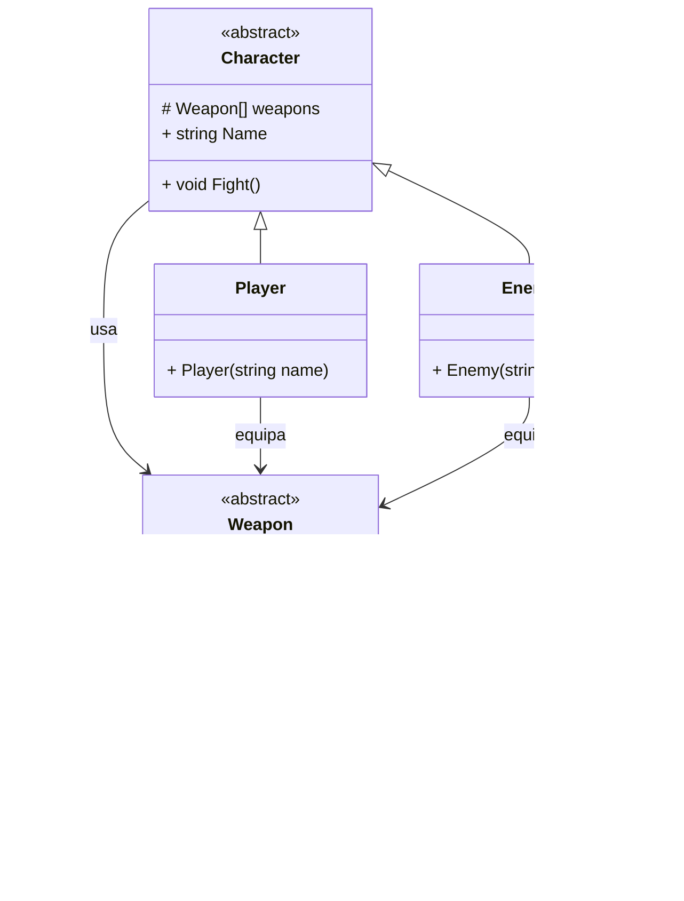

```mermaid
classDiagram

    class Character{
        <<abstract>>
        # Weapon[] weapons
        + string Name
        + void Fight()
    }

    class Weapon{
        <<abstract>>
        # float power
        + Weapon(float power)
    }

    class Player {
        + Player(string name)
    }
    
    class Enemy {
        + Enemy(string name)
    }

    class Gun {
        + int Ammo
        + Gun(float power, int ammo)
        + void FireGun()
    }

    class Sword {
        + float BladeLength
        + Sword(float power, float bladeLength)
        + void AttackWithSword()
    }

    Character <|-- Player
    Character <|-- Enemy

    Weapon <|-- Gun
    Weapon <|-- Sword

    Character --> Weapon : usa
    Player --> Weapon : equipa
    Enemy --> Weapon : equipa
```